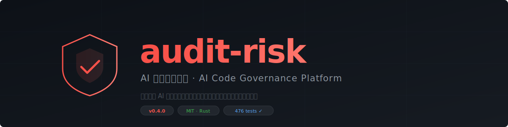

<p align="center">
  
</p>

<p align="center">
  <a href="LICENSE"></a>
  <a href="https://github.com/290864310liujiasheng-wq/hologram-audit-risk/actions"></a>
  <a href="https://github.com/290864310liujiasheng-wq/hologram-audit-risk/releases"></a>
  <a href="https://github.com/290864310liujiasheng-wq/hologram-audit-risk/pulls"></a>
</p>

> **AI 编码治理平台**
>
> 不管团队用 Codex、Cursor、Copilot 还是其他 AI 工具写代码，高风险代码在进入主分支前都经过同一套规则检查，留下可复核的审计记录。

---

## 快速接入（GitHub Action）

在你的仓库里新建 `.github/workflows/audit-risk.yml`：

```yaml
name: audit-risk

on:
  pull_request:
    branches: [main, master]

jobs:
  audit-risk:
    name: AI代码风险审查
    runs-on: ubuntu-latest
    permissions:
      contents: read
      pull-requests: write

    steps:
      - uses: actions/checkout@v4

      - uses: 290864310liujiasheng-wq/hologram-audit-risk/.github/actions/audit-risk@v0.4.0
        with:
          workspace: '.'
          fail-on: 'require_approval'   # warn / require_approval / block
          comment-on-pr: 'true'
```

接入后，每个 PR 自动触发风险扫描，结果以 Check Run 显示在 PR 页面，命中高危规则自动在 PR 下方发布中文说明。

---

## 本地安装

**一行安装（macOS / Linux）：**

```sh
curl -sSf https://raw.githubusercontent.com/290864310liujiasheng-wq/hologram-audit-risk/main/install.sh | sh
```

**手动下载：** 从 [Releases](https://github.com/290864310liujiasheng-wq/hologram-audit-risk/releases) 页面下载对应平台的预编译二进制：

| 平台 | 文件名 |
|---|---|
| macOS Apple Silicon | `audit-risk-macos-arm64` |
| macOS Intel | `audit-risk-macos-x64` |
| Linux x64 | `audit-risk-linux-x64` |
| Linux ARM64 | `audit-risk-linux-arm64` |
| Windows x64 | `audit-risk-windows-x64.exe` |

**从源码构建：**

```sh
git clone https://github.com/290864310liujiasheng-wq/hologram-audit-risk.git
cd hologram-audit-risk/engine
cargo build --release --bin audit-risk
# 二进制在 target/release/audit-risk，将其加入 PATH
```

---

## 这是什么

`audit-risk` 是 AI 代码进入主分支前不可绕过的治理门。

**解决的问题**：团队里有人用 Cursor、有人用 Copilot、有人用 Codex，每个工具生成的代码风格不同，安全边界不同，但它们都要进同一个 git 仓库。`audit-risk` 在 PR 合并前统一拦截高风险 AI 代码，要求审批或直接阻断，并留下谁提交了什么、命中了什么规则、谁批准或拦截的完整记录。

**和 Semgrep / CodeQL 的区别**：它们是代码扫描器，发现问题后告诉你。`audit-risk` 是治理门，发现问题后可以阻止合并、要求审批、并记录决策链——证据不只是"扫到了什么"，而是"谁在什么时间对什么做了什么决定"。

---

## 核心能力

- **规则拦截**：把 AI 生成的高风险代码收口为 `allow`、`warn`、`require_approval`、`block`
- **中文白话解释**：每个 finding 说明位置、原因、影响和建议，不只是规则编号
- **受控自修复**：修复方案经二次审计、验证和审批，才允许应用
- **可追溯审计链**：所有决策、审批、修复、回滚进入 SHA-256 哈希链审计日志
- **CI/CD 集成**：输出结构化 JSON 和退出码，Git Hook、GitHub Action 直接消费
- **纯本地部署**：源码、diff、密钥、审计记录不上传云端；客户接入自己的模型 API

---

## 检测能力（诚实口径）

用固定语料集（`engine/tests/detection_corpus/`）持续测量，CI 门禁锁定退化即失败：

| 指标 | 当前 |
|---|---|
| 召回率 | **37/37 = 100%** |
| 误报率 | **0/12 = 0%** |

**现在检测**：硬编码密钥（OpenAI/AWS/Stripe/GitHub/Slack/Google等前缀）、高熵字符串、`.env` 无引号密码赋值、数据库连接串明文密码、字符串拼接/插值式 SQL 注入（Python f-string、JS 模板字面量、`+` 拼接、`%` 格式化、`str.format()`）、危险动态执行（`eval`/`exec`/`os.system`/`os.popen`/`shell=True`/`execSync`/`subprocess.getoutput`）、IAM `*` 通配符、Hex 格式密钥

**已知盲区**：路径穿越、弱哈希（MD5）、SSRF、不安全反序列化、云服务连接串（GCP/Azure）。这些在路线图上，当前版本不假装能做。

---

## 常用命令

```sh
# 初始化工作区（生成 .hologram/ 配置、Git Hook、CI workflow 模板）
audit-risk init .

# 扫描当前工作区
audit-risk check .

# 持续监听变化
audit-risk watch .

# 扫描两个版本之间的差异
audit-risk diff <before> <after>

# 诊断环境配置
audit-risk doctor .

# 查看审计日志
audit-risk audit . --query review --limit 20

# 生成机器可读报告
audit-risk report . --output report.json

# 查看当前规则摘要
audit-risk rules .
```

---

## 产品版本

| 版本 | 价格 | 包含 |
|---|---|---|
| **Core** | 免费 | CLI 全部命令 + 基础规则包（MIT 开源） |
| **Team** | ¥299/月（按仓库数）| + GitHub Action + MCP 约束注入 + LLM 语义审查 |
| **Enterprise** | 合同制 | + 数据飞轮 + 团队专属规则模型 |

---

## 技术栈

- **语言**：Rust（单一自包含二进制，无运行时依赖）
- **代码解析**：tree-sitter，支持 30 种语言
- **存储**：SQLite（代码图谱）+ JSONL（审计链）
- **签名**：Ed25519（授权验签）+ SHA-256（审计链完整性）

---

## 清理构建产物

```sh
./clean.sh --dry-run   # 预览将删除的内容
./clean.sh             # 实际清理（仅删除可重建产物）
```

---

## 参与贡献

见 [CONTRIBUTING.md](CONTRIBUTING.md)。新增检测能力请在 `engine/tests/detection_corpus/bad/` 添加样本，确保 `cargo test --test detection_quality` 仍保持召回 100%/误报 0%。
